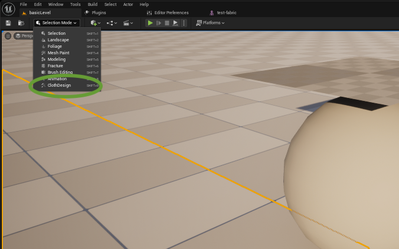
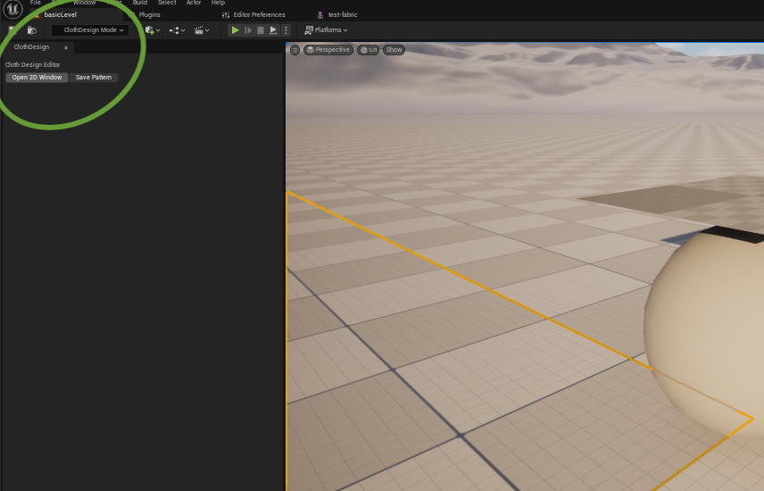
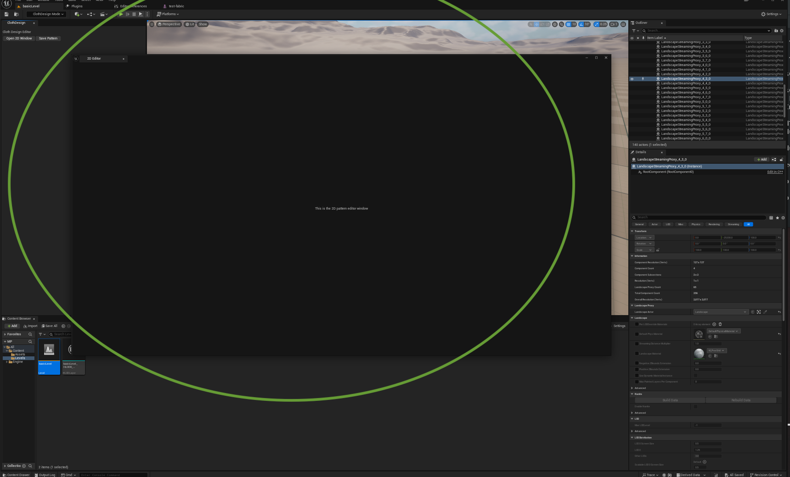

## Masters Project: Cloth Design Plugin for Unreal Engine 5.5 on Linux
### Project Update
I looked over my initial presentation (available [here](https://livebournemouthac.sharepoint.com/:b:/r/sites/MScCAVE202425/Shared%20Documents/MSc%20Project/Initial%20Presentations/Marisa-MSc-Presentation.pdf?csf=1&web=1&e=PkPUL9)) and slightly revised the goals to focus on the most important ones first. I also included an update on what's working so far and what I'll be working on next.
# 
### Revised Plan (Minimal Goals)
I am still working with these three main goals: pattern creation in 2D, edge-based sewing and cloth simulation in 3D.
#### Pattern Creation
- 2D viewport
- Basic drawing tools (starting with rectangles)
- Save format for 2D patterns
#### Sewing
- Edge-based sewing (starting with full-edge connections, so one full edge of one piece is connected to a full edge of another piece)
#### Simulation
- Cloth simulation using Chaos Cloth in Unreal Engine
- Garment-body collisions
- Editable fabric settings or some basic presets (like jersey, denim, wool, etc)
#
### Progress So Far
- Explored Unreal Engine’s C++ workflow and plugin system
- Created a custom editor mode that can be imported as a plugin (screenshot below)
- So far the editor mode just has a basic interface with two buttons (screenshot below)
- One of the buttons opens a 2D viewport, which is where the pattern creation and sewing tools will live (screenshot below)
- Started with the simulation using Chaos Cloth

### What’s Next
- Get the 3D cloth simulation working in C++ instead of Blueprints
- Add simple editable fabric settings (or some presets)
- Then, start on the 2D viewport interface beyond just opening it, such as drawing tools and save logic

#
### Selection of custom editor mode

#
### Editor mode buttons

#
### This empty 2D viewport opens from the button in the editor mode 

#
#

to run tests either go to Riders test section in the bar on the left and run the tests there by clicking 'run unit tests'. or go to UE: tools > session frontend > automation > search for your tests there and click run to check them in UE

crtl shift b
save before 

in UE to switch between viewports click alt g h j k for the main different ones

uproperty:
, clothdesignintera, simple tool cloth design, a cloth patternmeshactor,

patternsewingconstraints
uclothshapeasset

sources:
https://dev.epicgames.com/documentation/en-us/unreal-engine/API/Runtime/GeometryCore/CompGeom/PolygonTriangulation__Triangulat-/1
https://dev.epicgames.com/community/learning/tutorials/LZZo/unreal-engine-epic-games-store-chaos-cloth-updates-5-6

https://github.com/jothepro/doxygen-awesome-css?tab=readme-ov-file

------------

ensure spawned actors contain actors when meshes are generated
in the traignulate all meshes section im guessing

where do i put the definition of this in teh triagnulate func: 	
TArray<int32> PolyIndexToVID; //?

You must ensure the SpawnedPatternActors array in FCanvasSewing
is populated at mesh creation and uses the same ordering as the 
CompletedShapes array so ShapeIndex references map to the right actor. 
If you generate meshes in a separate step, have the mesh generation 
call populate FCanvasSewing::SpawnedPatternActors (or provide a 
registration API).

If you spawn actors from multiple places, centralize actor 
registration into one manager or call 
FCanvasSewing::RegisterSpawnedActor(TWeakObjectPtr<APatternMesh>) 
at creation time.

If your seam endpoints are not on the same shape boundary 
order/orientation (A vs B reversed), you may need to reverse 
the index sequence or reverse SeamVIDsB before alignment so 
corresponding samples pair in the correct order.

----------

FPatternSewingConstraint (your Unreal USTRUCT) which stores mesh components, vertex indices, stiffness, and screen points — used at runtime for physics/sewing constraints.

FSeamDefinition (my suggestion), which just stores the indices of shapes and edges for bookkeeping multiple seams in your canvas editor.