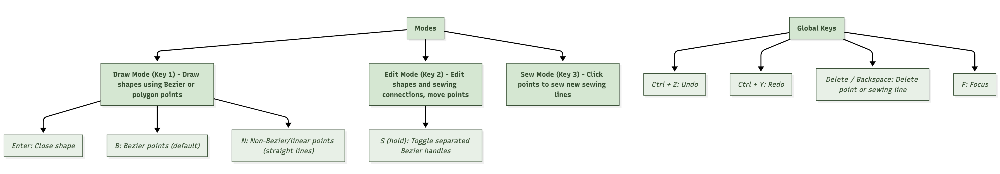
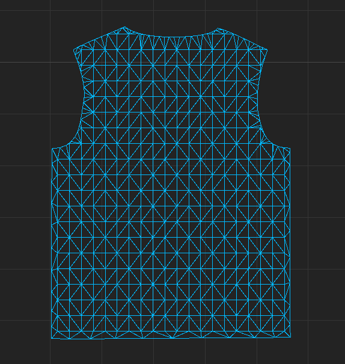
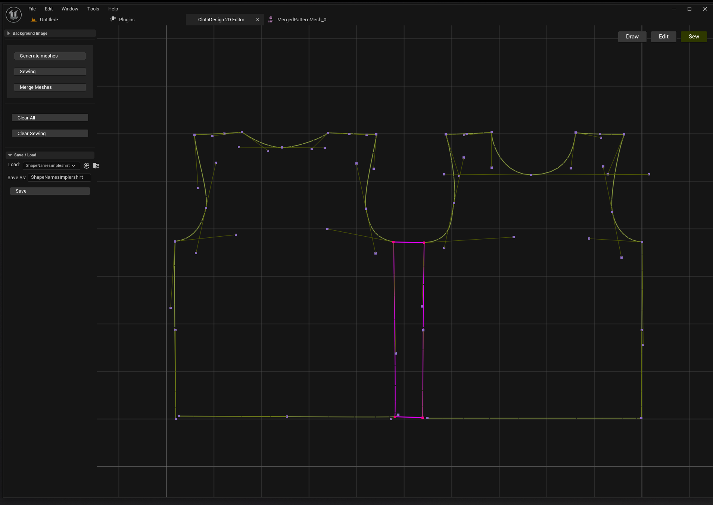
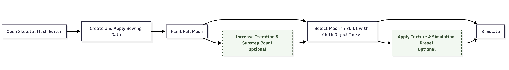
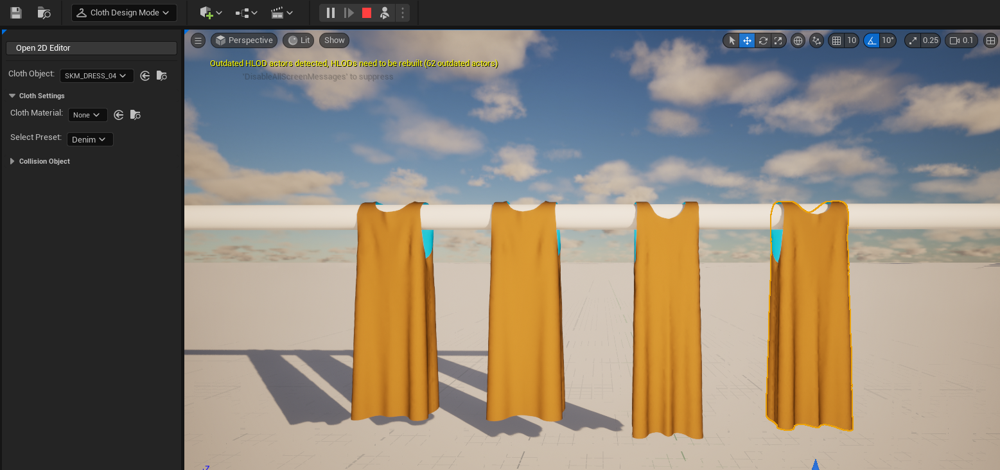
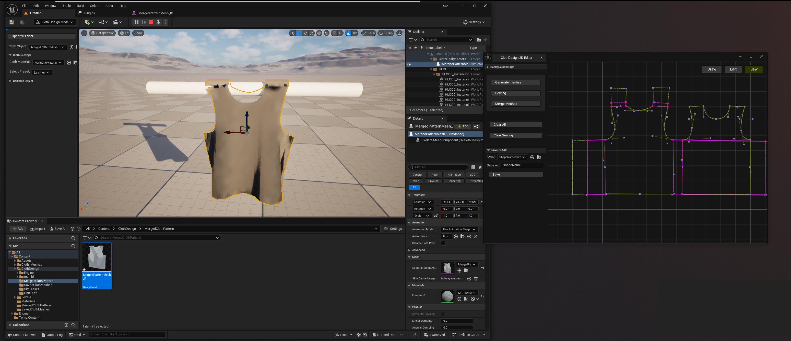

# Cloth Design Plugin for Unreal Engine 5.5 on Linux
### 

A lightweight Unreal Engine 5.5 plugin that brings 2D pattern drafting, automatic mesh generation 
and real-time cloth simulation (via Chaos Cloth) into a single, in-editor workflow.

With this plugin, users can:

- Sketch and edit 2D garment patterns directly in UE

- Automatically generate triangulated meshes from flat patterns

- Define seams and preview cloth draping in real time using UE’s built-in simulation

- Iterate quickly without relying on external tools

Built entirely on UE’s native geometry and UI modules, the plugin demonstrates a streamlined approach 
to digital garment creation, suitable for both real-time previews and 
cinematic pipelines, while highlighting new possibilities for UE’s native systems in cloth design.

#
## Plugin User Instructions

### 1. Loading the Plugin (installation video [here](https://www.youtube.com/watch?v=EFWlgoQcySg))
- Create a C++ Unreal Engine project and add a "Plugins" folder.
- Download and unzip the plugin's zip file (ClothDesignPlugin.zip).
- Copy the ClothDesignAssets folder in Content Drawer of your project.
- Copy the ClothDesign folder into the Plugins folder in your project.
- Launch Unreal Engine and ensure the ClothDesign plugin is installed.
- The plugin UI will now be available in the Editor Mode section.

### 2. Accessing 3D Controls (full workflow video [here](https://www.youtube.com/watch?v=gF__ZoG9WPg))

- Enter the ClothDesign Editor Mode to access the 3D-side controls.
- Available controls:
  - 2D Editor Launch Button: Opens the 2D pattern authoring surface.
  - Cloth Asset Picker: Select the cloth mesh for simulation.
  - Material Picker: Choose a material for your cloth mesh.
  - Preset Selection: Quickly apply preconfigured simulation settings for common materials (denim, leather, silk, jersey or custom).
  - (Optional but does not yet extend functionality: Collision Asset Picker: Assign collision meshes.)

    
### 3. 2D Editor Overview
The 2D Editor is used to create and edit pattern pieces and seams.

#### 3.1 Modes
- Draw Mode:
  - Place points on the canvas to create pattern shapes.
  - Toggle point types:
    - Bézier points: Press B
    - Linear/non-Bézier points: Press N
- Edit Mode:
  - Move points and Bézier handles.
  - Separate Bézier handles: Press S
  - Delete points or handles: Backspace or Delete
  - Undo/Redo: Ctrl + Z / Ctrl + Y
- Sew Mode:
  - Define seam correspondences by clicking start and end points on two pattern pieces.
  - Remove seams by selecting and deleting connecting lines in Edit Mode.

#### 3.2 Additional Controls
- Clear All or Clear All Sewing: Buttons in the left panel.
- Save/Load Shapes: Save your work and load previously saved pattern data.
- Background Textures: Optionally import textures from the content browser to trace existing patterns.

### 4. Converting 2D Patterns to 3D Meshes
- Finalise your 2D shapes on the canvas.
- Click Generate Meshes to triangulate and create 3D meshes.
- Position meshes in the 3D viewport to match collision geometry.
- Select edges to sew and click Sewing to finalise connections.
- Merge pattern pieces into a single mesh with Merge Meshes for simulation.

Note: Sewing and merging are separate steps to allow precise placement before combining.

### 5. Preparing Skeletal Mesh for Simulation
Once the merged skeletal mesh is saved in the content browser:
- Open the Skeletal Mesh Editor
- Create and apply Clothing Data.
- Enter Cloth Painting Mode and paint the mesh entirely.
- Exit painting mode.
- Optional: Adjust clothing settings (iteration, subdivisions) to improve simulation accuracy and collision handling.

### 6. Final Simulation Setup
- Select the skeletal mesh in the Cloth Object Picker on the 3D UI.
- Assign a material and select a Simulation Preset.
- The mesh is now ready to simulate using the grey "Simulate" button in the top bar.
- The most reliable collisions can be achieved with UE native geometry (like cylinders and spheres). Add these from the Shapes menu on the right of the editor mode selection window. 

Note: The cloth and material pickers also work with externally imported meshes (e.g., Marvelous Designer), enabling fast setup for any cloth asset in UE (video [here](https://www.youtube.com/watch?v=RBReJKRiPME)).

#
# Requirements:
- Unreal Engine 5.5 - developed and tested in UE 5.5
- Linux - tested on Linux only

#
# Testing

To run the tests, there are two options:

In Rider: Open the Tests panel from the left-hand toolbar and select Run Unit Tests.

In Unreal Engine: Navigate to Tools > Session Frontend > Automation, locate the tests using the search function, and click Run to execute them within the editor.

#
# Videos

### [Installation](https://www.youtube.com/watch?v=EFWlgoQcySg)

### [Full workflow](https://www.youtube.com/watch?v=gF__ZoG9WPg)

### [Workflow for imported meshes](https://www.youtube.com/watch?v=RBReJKRiPME)

# 
# Acknowledgements & Sources

- The Unreal Engine C++ API documentation was used as a reference for plugin structure and module functionality.

  Available here: https://dev.epicgames.com/documentation/en-us/unreal-engine/API?application_version=5.5

- The Unreal Engine 5.5 documentation was used for in editor workflow reference and functionality.

  Available here: https://dev.epicgames.com/documentation/en-us/unreal-engine/API?application_version=5.5

- Doxygen Awesome was used as a custom CSS theme for Doxygen HTML documentation.

  Available here: https://github.com/jothepro/doxygen-awesome-css?tab=readme-ov-file
- GitHub Copilot and ChatGPT were used to assist with exploring concepts, debugging and documentation.

#

# Images

### Modes and shortcuts overview

#

### Mesh triangulation result

#
### Seam placement and highlighting (pink connecting lines)

#
### The following workflow remains after mesh creation

#
### Example of the different simulation presets applied to an imported mesh (left to right: denim, leather, silk, jersey).

#
### Full overview of drawn, triangulated, sewn and then simulated mesh in UE.

